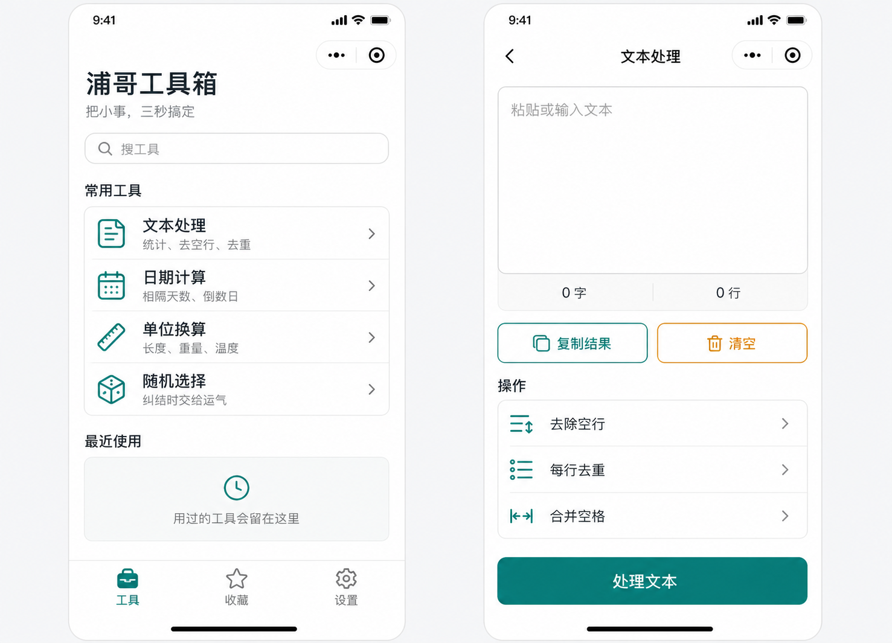

# 浦哥工具箱 · Pugo Toolbox

[](https://github.com/QAQgpnu/pugo-toolbox/actions/workflows/quality.yml)
[](https://github.com/QAQgpnu/pugo-toolbox/releases)
[](LICENSE)

31 个本地优先的原生微信小程序工具：不要求登录，不需要自建后端，不在代码中配置 API key。文本、生活记录、周期日期和图片处理结果默认留在当前设备。

> A privacy-first native WeChat Mini Program with 31 practical offline utilities, zero runtime dependencies, no custom backend, and no API credentials.



> 上图是设计概念图，用于说明视觉方向；实际功能和验证状态以下方代码、测试和 QA 边界为准。

## 为什么做这个项目

很多“小工具”要登录、看广告或把输入发送到服务器。浦哥工具箱选择另一条路线：把高频、明确的小需求收进一个原生小程序，尽量三步内给出结果，并优先在本机完成计算和图片处理。

- 31 个工具、6 个分区，统一搜索、分类、收藏和最近使用。
- 原生微信小程序，不引入前端框架或运行时依赖。
- 纯函数与页面契约分层，Node.js 可离线运行回归测试。
- 正式 AppID、云环境、历史云函数和账号发布资料不进入公开仓库。
- 自动化结果与微信开发者工具、真机验证严格分开报告。

## 功能地图

| 分区 | 代表工具 |
|---|---|
| 防健忘 | 安心自查、东西放哪了、该换了、临时记住、冰箱先吃谁 |
| 生活试算 | 日期计算、单位换算、公积金试算、养老金试算、宠物年龄、驾照记分周期、一起算清 |
| 办公助手 | 文本处理、图片压缩、证件照换底、时间水印、金额大写、Excel 公式与报错、表格整理、会议成本 |
| 轻松一下 | 功德木鱼、今日摸鱼、每天值多少、成长番茄钟 |
| 女生专区 | 化妆品成分对比、周期记录 |
| 男生专区 | Steam 限免手工清单与截止提醒 |

- 证件照换底使用本机边缘连通算法，只处理用户主动选择的纯色背景图片。
- 化妆品成分对比使用微信端侧 OCR，识别结果可校对，不提供医疗或过敏结论。
- Excel 公式与报错诊断使用内置资料，不调用生成式 AI。
- Steam 限免雷达是本机手工清单，不联网抓取，也不承诺自动推送。

## 30 秒开始

只需要 Node.js 20+，不需要安装依赖：

```bash
git clone https://github.com/QAQgpnu/pugo-toolbox.git
cd pugo-toolbox
npm test
npm run preflight
```

在微信开发者工具中选择“导入项目”，目录指向仓库根目录。公开配置使用 `touristappid`；点击编译后，从首页中央“＋”打开完整工具抽屉。

如果游客模式限制某项微信原生能力，请复制 `project.config.json` 为自己的私有配置并填写自己的 AppID；不要提交 `project.private.config.json`。

## 工程结构

```text
.
├── components/bottom-nav/   # 三栏导航、中央工具抽屉
├── pages/                   # 每个工具独立页面四件套
├── utils/                   # 纯算法、工具注册、本地存储、隐私边界
├── assets/brand/            # 公开品牌图片
├── tests/                   # 零依赖回归测试与公开发布预检
├── docs/                    # 架构、隐私、安全和 QA 证据
├── app.js / app.json / app.wxss
└── project.config.json      # touristappid，无正式账号配置
```

更完整的结构说明见 [架构文档](docs/architecture.md)。

## 数据与隐私边界

- 无登录、无自建后端、无云函数、无 API key。
- 普通记录使用微信本地缓存；清理缓存或删除小程序后可能丢失。
- 表格原文、财务参数、成分原文和图片不写入工具历史。
- 图片只在用户主动选择后处理，只在用户主动点击后保存到相册。
- 非敏感工具仅保留固定 ID 的可选平台匿名事件；周期、表格、成分和证件照完全阻断匿名事件。

详见 [隐私与公开边界](docs/privacy-boundary.md) 和 [安全说明](SECURITY.md)。

## 已验证与未验证

**已自动化验证：** 74/74 项通过，覆盖工具算法、页面四件套、注册与导航契约、本地存储、敏感工具埋点阻断、JSON/JavaScript/WXML/WXSS 静态规则和公开仓库边界。

**仍需设备验证：** iPhone、Android、鸿蒙上的相机、端侧 OCR、相册保存、公众号组件和不同微信基础库行为。

完整结果见 [QA 报告](docs/qa-report.md) 和 [安全复核](docs/security-review.md)。

## 设计原则

1. 真实可用优先于功能数量。
2. 本机处理优先于上传和账号体系。
3. 能离线测试的逻辑从页面中拆出。
4. 不把估算、经验或模拟结果写成官方结论。
5. 新功能必须说明数据流、失败方式和验证边界。

## Roadmap

见 [docs/roadmap.md](docs/roadmap.md)：优先补真实设备矩阵、演示素材和来自 Issue 的需求，不为版本号堆功能。

## 参与贡献

欢迎提交 Bug、文档改进和小而明确的工具建议。请先阅读 [CONTRIBUTING.md](CONTRIBUTING.md)。如果这个项目对你有帮助，欢迎 Star，让更多需要本地优先小工具的人看到它。

## License

[MIT](LICENSE) © 2026 QAQgpnu
